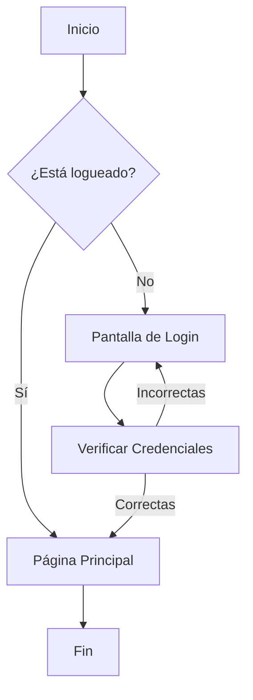

|-:Encabezado ---: | Encabezado 2|

> [!NOTE]
> Esta es una nota

> [!TIP]
> esto es un tip

>[!IMPORTANT]
>Esto e impoirtante

$$3^{4^5} + \frac{1}{2}$$ $$int_{0}^{\infty} e^{-x^2} \, dx = \frac{\sqrt{\pi}}{2}$$ 

